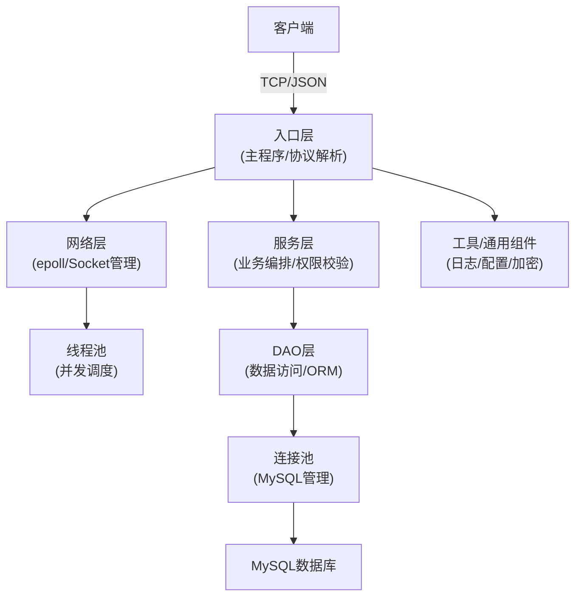

# ChatRoom 聊天室后端

## 简介
ChatRoom 是一个基于 C++20 的高性能聊天室后端，采用事件驱动与多线程并发架构，支持多用户实时通信、房间管理与消息持久化，面向高并发场景优化。

## 技术栈与架构亮点

- **C++20**：主力开发语言，利用现代 C++ 的类型安全与高效特性。
- **epoll + 非阻塞 IO**：Linux 下高性能事件驱动模型，支撑高并发长连接。
- **轻量级线程池**：任务并发调度，提升多核利用率，结构简单高效。
- **MySQL（预处理语句 + 连接池管理）**：预处理语句防 SQL 注入，连接池提升并发访问效率。
- **jsoncpp**：JSON 协议解析与序列化，实现客户端与服务端数据交换。
- **OpenSSL**：密码哈希和加密，提升用户数据安全性。
- **CMake**：跨平台构建，便于依赖管理和工程集成。

## 架构分层示意

## 主要特性
- 用户注册、登录、登出
- 用户信息修改（昵称、密码）
- 聊天室房间的创建、删除、修改、查询
- 房间人数上限、房间描述、房间状态管理
- 消息实时发送与接收
- 聊天记录持久化与历史消息拉取
- 管理员与普通用户权限分级

## 未来展望

- **性能优化**
  - 进一步细分锁的粒度，减少临界区，提高多线程并发性能
- **功能完善**
  - 支持离线消息、消息推送、消息撤回、@提醒、文件/图片发送等高级聊天功能
- **前端体验**
  - 开发配套前端 UI，提升用户交互体验